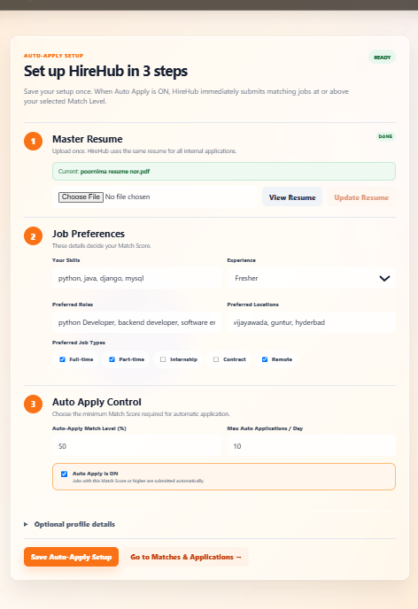
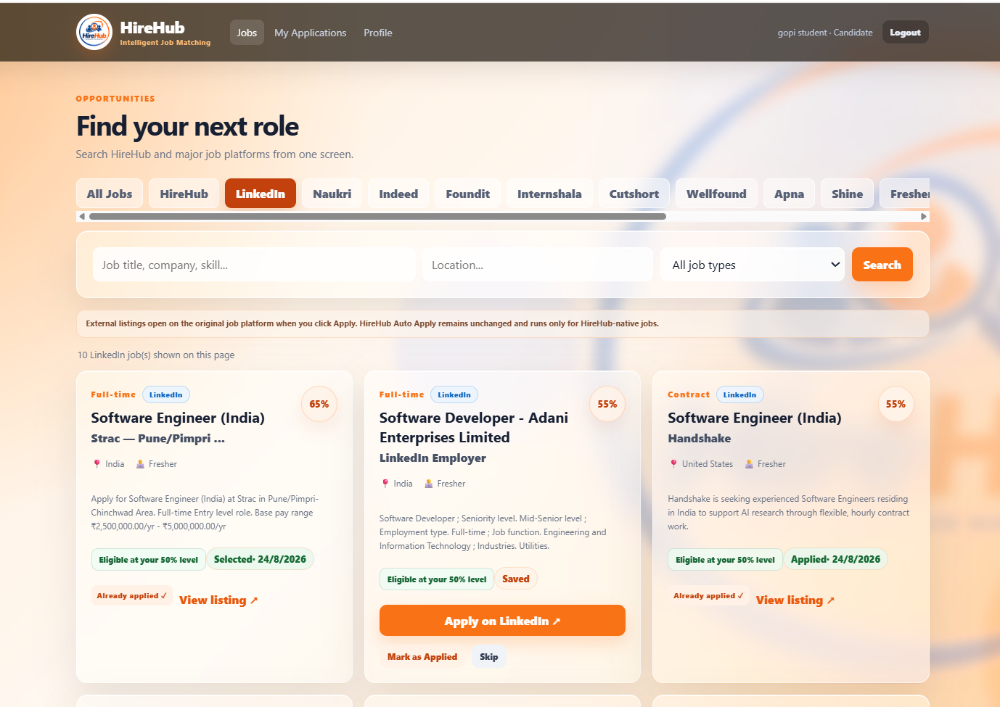
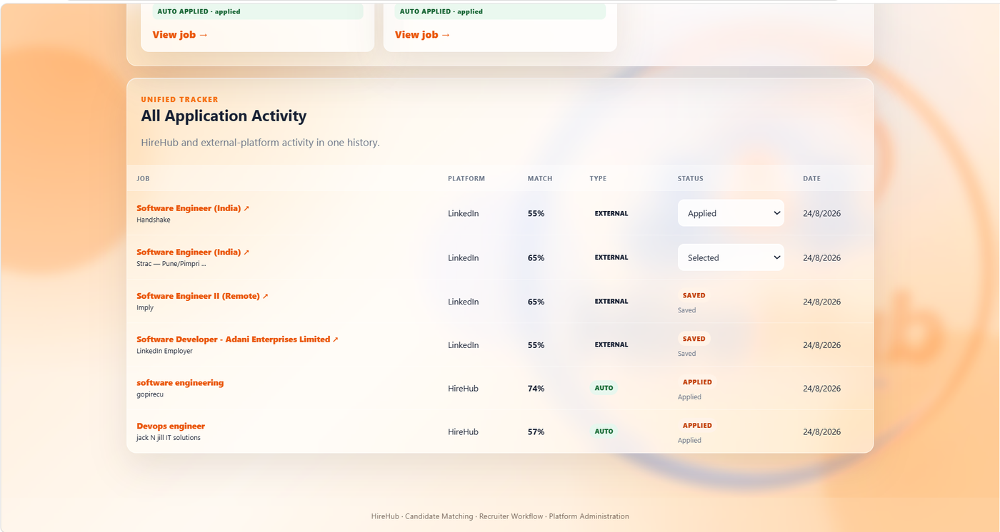
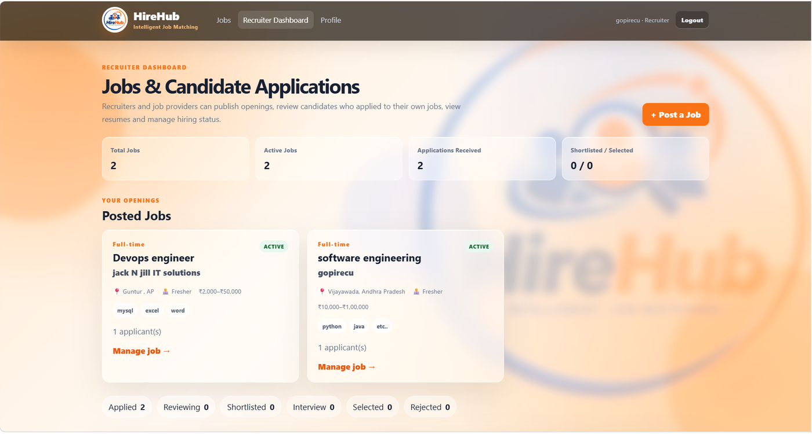
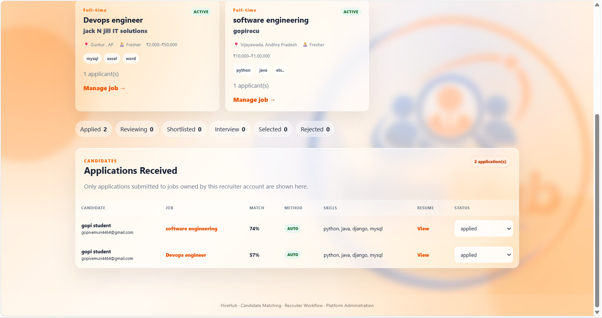

# HireHub — Intelligent Job Matching & Recruitment Platform

HireHub is a full-stack recruitment platform designed to connect **jobseekers, recruiters, and platform administrators** in one workflow. It combines role-based dashboards, weighted candidate-to-job matching, Master Resume management, native HireHub Auto Apply, external job discovery, and unified application tracking.

> **Important:** Auto Apply is implemented for **HireHub-native jobs**. External listings open on the original job platform for the final application, while HireHub can save, track, and organize that activity.

## Why HireHub?

Jobseekers often search across several job platforms, repeatedly enter the same preferences, and manually track where they applied. Recruiters also need a clear way to publish openings, review matching candidates, view resumes, and manage hiring status.

HireHub brings those workflows into one application with a reusable candidate profile and a transparent weighted Match Score.

## Core Features

### Jobseeker / Candidate
- Candidate registration and secure login
- Master Resume upload and reuse for internal applications
- Skills, experience, preferred roles, locations, and job-type preferences
- Configurable Auto Apply Match Level
- Configurable maximum automatic applications per day
- Match Score displayed for suitable jobs
- Native HireHub automatic applications
- External job discovery and original-platform application links
- Save / skip / mark-as-applied actions for external jobs
- Unified application history across HireHub and external platforms

### Recruiter / Employer
- Recruiter account and dedicated dashboard
- Create and manage job openings
- View applications received for owned jobs
- Candidate Match Score and skills visibility
- Resume viewing
- Hiring workflow status management such as Applied, Reviewing, Shortlisted, Interview, Selected, Rejected, and Hired

### Platform Administration
- Separate administrative access
- User and job management
- Platform-level recruitment and application statistics
- Candidate / recruiter activity visibility

## Intelligent Match Score

HireHub calculates a weighted score between a candidate profile and a job:

| Matching factor | Weight |
| --- | ---: |
| Skills | 50% |
| Preferred Role | 20% |
| Location | 15% |
| Job Type | 10% |
| Experience | 5% |
| **Total** | **100%** |

The score is used to rank opportunities and determine whether a HireHub-native job meets the candidate's configured Auto Apply threshold.

## Application Flow

1. A candidate creates an account.
2. The candidate uploads a Master Resume and configures skills and job preferences.
3. HireHub calculates Match Scores for jobs.
4. If Auto Apply is enabled, eligible **HireHub-native** jobs at or above the selected threshold can be submitted automatically, subject to the daily limit and duplicate-application checks.
5. External listings are discovered and matched inside HireHub, then opened on the original platform when the candidate chooses to apply.
6. Internal and external activity is shown together in the unified tracker.
7. Recruiters review applicants and update hiring status from their dashboard.

## Screenshots

### Account Creation
<p align="center">
  
</p>

### Login
<p align="center">
  
</p>

### Auto Apply Setup
<p align="center">
  
</p>

### Candidate Job Discovery & Match Scores
<p align="center">
  
</p>

### Unified Application Tracker
<p align="center">
  
</p>

### External Job Discovery
<p align="center">
  
</p>

### Recruiter Dashboard
<p align="center">
  
</p>

### Recruiter Application Management
<p align="center">
  
</p>

## External Job Sources

The project includes source definitions for platforms such as **LinkedIn, Naukri, Indeed, Foundit, Internshala, Cutshort, Wellfound, Apna, Shine, Freshersworld, Glassdoor, Workday, Greenhouse, and Lever**. External discovery uses the configured search provider and directs the user to the original source for the final application.

## Tech Stack

| Layer | Technology |
| --- | --- |
| Frontend | React 19, React Router, Axios, Vite |
| Backend | Node.js, Express.js |
| Database | MySQL |
| ORM | Sequelize |
| Authentication | JWT, bcryptjs |
| Resume Uploads | Multer |
| External Job Discovery | SerpAPI integration |
| API Style | REST |

## Project Structure

```text
Hire Hub/
├── client/                  # React + Vite frontend
├── server/                  # Express + MySQL backend
├── docs/
│   └── screenshots/         # GitHub README screenshots
├── START_HIREHUB.bat        # Windows one-click launcher
└── README.md
```

## Local Setup

### Requirements
- Node.js LTS
- npm
- MySQL

### Backend

```bash
cd server
npm install
```

Copy the environment template and configure your database/JWT values:

```bash
copy .env.example .env
```

For external job discovery, configure `SERPAPI_KEY` in `server/.env` when required.

Start the API:

```bash
npm start
```

Backend default URL: `http://localhost:5000`

### Frontend

```bash
cd client
npm install
npm run dev
```

Frontend default URL: `http://localhost:5173`

### Windows One-Click Start

After the environment is configured, the included `START_HIREHUB.bat` can check/install packages, start the backend, wait for the API health check, start the frontend, and open HireHub in the browser.

## Security & Repository Notes

- Keep `.env` files out of GitHub.
- Do not commit uploaded resumes or production database backups.
- Use a strong `JWT_SECRET` outside development.
- External platform names belong to their respective owners; HireHub links users to original external listings rather than representing those platforms.

## Project Highlights

- Three-role recruitment workflow
- Transparent weighted job-matching algorithm
- Master Resume based native Auto Apply
- Daily Auto Apply controls and duplicate prevention
- Recruiter candidate review and hiring-status workflow
- External opportunity discovery from one screen
- Unified internal + external application tracking
- Full-stack React, Express, Sequelize, and MySQL implementation

---

**HireHub — Intelligent Job Matching**
